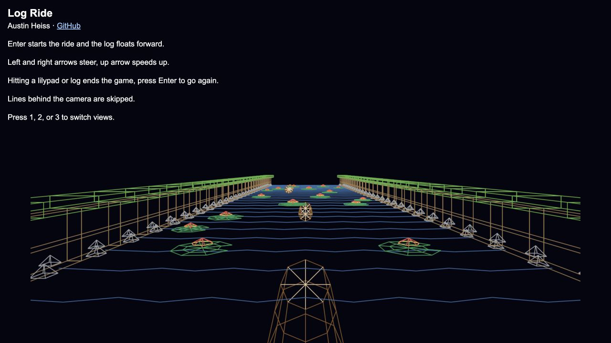
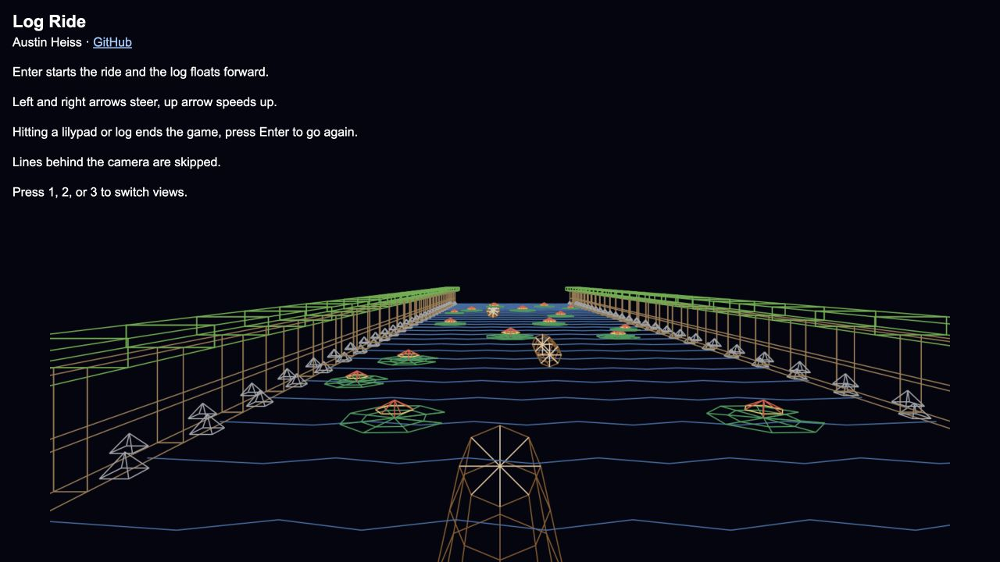
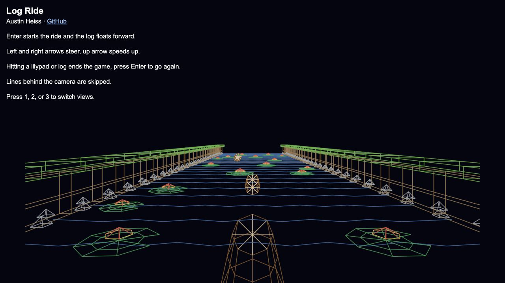
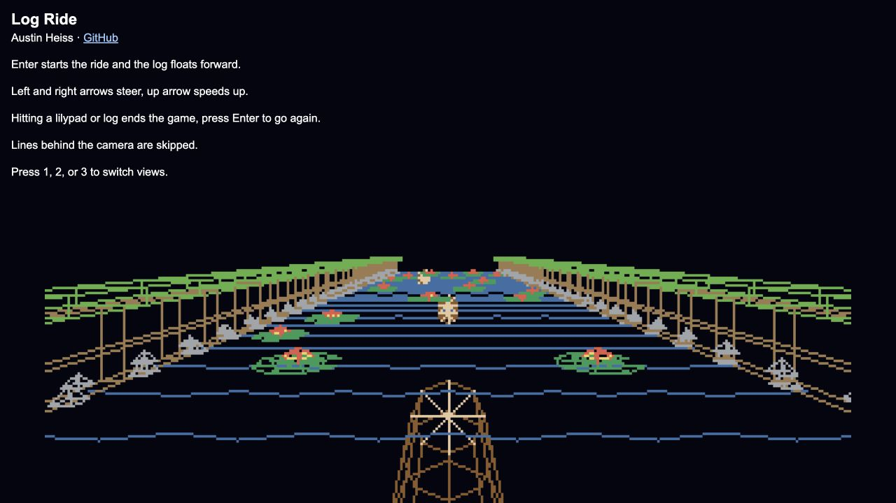
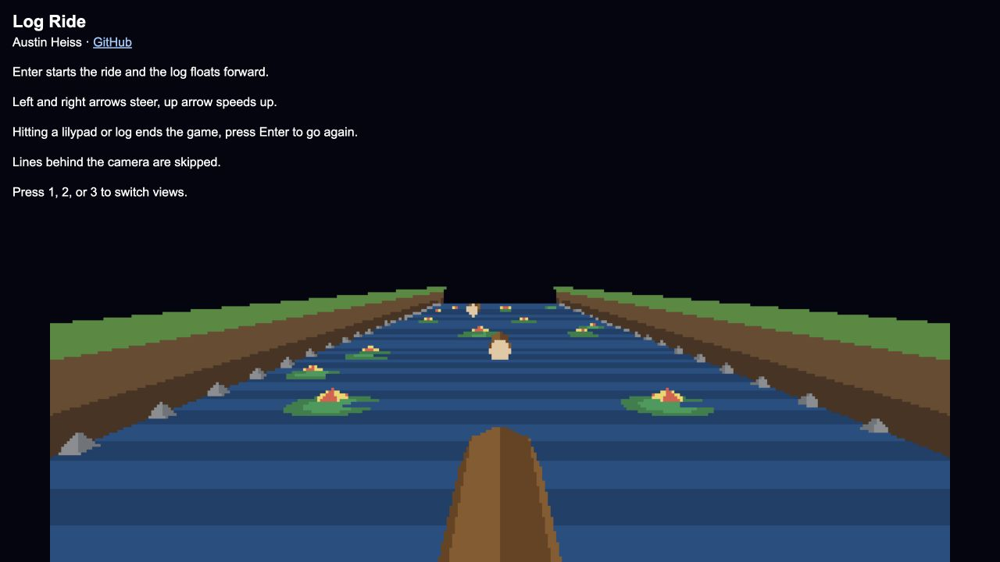
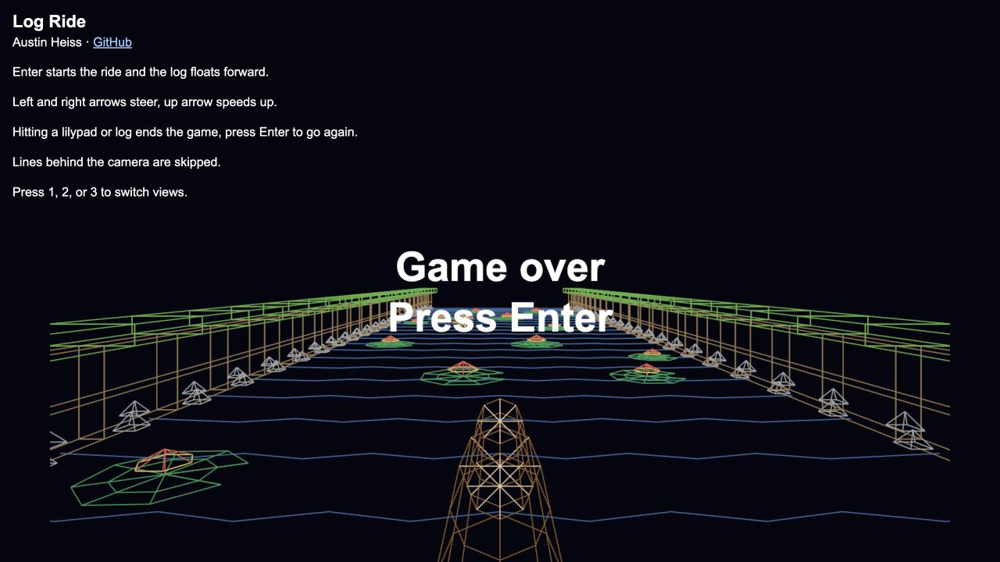

# Log Ride

Log Ride is a small browser game and a software-rendering exercise. You can play it using the [hosted version](https://pinhole-camera-project1cg.vercel.app/)

## What you can do

The ride is already moving when the page opens. The camera advances along the river, and your log stays four world units in front of it. Water strips and bank segments repeat down the course; stationary logs and flower-topped lilypads are obstacles. Hitting a log or lilypad stops the ride and displays **Game over**. The scene does not have a finish screen: after passing the end of the course, the camera returns to the beginning.

| Key | Action |
| --- | --- |
| **← / →** | Steer left or right in half-unit steps. Steering is limited to the river. |
| **↑** | Move forward an extra half-unit. The ride also advances automatically. |
| **1** | Show the wireframe view. |
| **2** | Show the wireframe drawn into a 320 × 200 pixel grid with the incremental line algorithm. |
| **3** | Show filled triangles drawn into that grid with a depth buffer. |
| **Enter** | Reset the camera and course, including after a collision. |

The page header repeats the controls. Number keys also work on the game-over screen, but movement resumes only after **Enter**.

### Tour of the interface



**Starting ride.** The text above the canvas lists the controls. The player log is in the foreground; the water, banks, stationary logs, and lilypads establish the route ahead.



**Steering around an obstacle.** The arrow keys move the camera and log together, so the obstacle's apparent position changes while the log remains in front of the camera. The up arrow closes the distance faster.



**View 1: canvas lines.** The browser's 2D canvas strokes the projected model edges. The geometry remains visibly wireframe.



**View 2: incremental lines.** The same edges are plotted into a smaller color grid and enlarged into 5 × 5 canvas blocks, making individual raster pixels visible.



**View 3: filled triangles.** Triangles form the log, water, banks, and lilypads. A per-pixel depth test keeps the nearest filled surface at each grid cell.



**Collision and restart.** Touching an obstacle freezes forward motion and places a **Game over / Press Enter** message over the scene. Pressing **Enter** rebuilds the course and restarts from the beginning.

## How it works

### 1. Models are vertices, edges, and triangles

This project includes representations of four models: a log, a lilypad with a flower, a riverbank, and a river. Their source geometry is in [`models/`](models/). Each OBJ file contains `v` verticies, `l` edges, and triangular `f` faces. Color comments assign colors to subsequent edges or faces.

`parseObj()` in [`index.html`](index.html) reads those records into arrays of vertices, edges, and faces. Rather than copying every vertex for every obstacle, `buildRiver()` creates *instances* that share a model and supply a position and scale. The bank and water instances are tiled at regular intervals along the river, and the obstacles are placed at chosen positions. The corresponding OBJ text is embedded in [`models/models.js`](models/models.js), which is loaded before the renderer so direct file opening works without fetching local assets.

### 2. Pinhole Camera

In class we first talked about the pinhole relationship `u = x / z`, `v = y / z` where more distant points occupy less of the image. It first applies an instance's scale and translation, then subtracts the camera position to get the relative `(x, y, z)`. It computes screen coordinates as:

```text
u = (x / z) × focal_length + image_width / 2
v = image_height / 2 − (y / z) × focal_length
```

The offset centers the picture, and the minus sign changes upward-positive 3D `y` into downward-positive canvas `v`. View 1 of `Log Ride` uses a 1600 × 1000 image and focal length 900. Views 2 and 3 use a 320 × 200 grid and focal length 180, to preservce the same framing after their pixels grow. Points behind the near distance `z = 0.4` are not computed.

### 3. Creating Lines

Then we talked about incremental line drawing for integer endpoints and slopes between 0 and 1. The approach in class mentioned that this method can be extended to other slopes for Project 1, which is what we do for `Log Ride`. View 1 of `Log Ride` uses the browser's `moveTo()` / `lineTo()` / `stroke()` calls. In View 2, `plotLine()` uses the incremental approach. After rounding the projected endpoints to integer grid coordinates, it computes `steps = max(|dx|, |dy|)`, `xStep = dx / steps`, and `yStep = dy / steps`. It starts at the first endpoint, colors the nearest pixel, then adds `xStep` and `yStep` before coloring the next one. Using the larger axis for `steps` also handles steep, falling, and reversed lines. When both endpoints are the same, it colors one pixel.

`draw()` then paints each grid cell as a 5 × 5 rectangle on the full canvas. This is why view 2 shows the pixels that view 1 hides behind strokes.

### 4. Faces and Depth

Next we talked about bounding boxes, barycentric coordinates and half-plane tests, and the visibility problem. View 3 follows that these concepts in `fillTriangle()`:

1. Project the three vertices of an OBJ face.
2. Finds the triangle's screen-space bounding box and restricts it to the 320 × 200 grid.
3. At each pixel center `(x + 0.5, y + 0.5)`, we look at three signed edge functions. Dividing by the positive or negative triangle area gives barycentric weights. A pixel is inside when all three weights are positive.
4. Interpolate camera depth using the vertex depths, then color the pixel only when it is closer than the value already in the depth buffer.

The depth buffer starts at infinity for every frame. It lets near triangles cover far ones without sorting all the faces back to front, like in the painters algorithm. Faces use one flat color each. Views 1 and 2 draw only edges and do not use that depth buffer, so edges on the far side of a model can show through.

### 5. The ride loop and collision state

`setInterval(floatForward, 50)` advances the camera by 0.1 world units. Keyboard input can add forward or sideways movement. `placeLog()` updates the player log relative to the camera. `hitSomething()` checks the player's position against stationary logs and lilypads using distance/extent tests. On a hit, `splash()` changes the mode to `over`, stopping the automatic advance and displaying the overlay. **Enter** calls `buildRiver()` to restore the initial positions.

## Future work and current limits

- **Improve the collision feedback.** The function named `splash()` currently changes the game mode only. There is no animated splash, sound, or collision effect other than the static game-over text.
- **Make the route more complete.** The ride returns to the start when the camera passes `z = 54`, without a finish or score. A finish screen, progress indicator, and more obstacle layouts would give the player a better goal.
- **Extend rendering comparisons.** Views 1 and 2 expose back edges because they have no hidden-line removal. A later version could compare those wireframes against the depth-tested triangles.

## AI disclosure

Generative AI aided in the vertex, edge, and triangle data for the log, green part of the lilypad, and water models. It also assisted with parts of the JavaScript implementation to load in the .obj files, create the event listener for getting user inputs, and with drafting and editing the markdown formatting of this README. AI was also used to poke holes in my implementations as I worked.